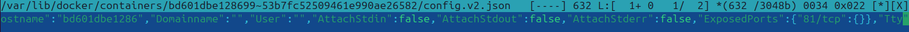
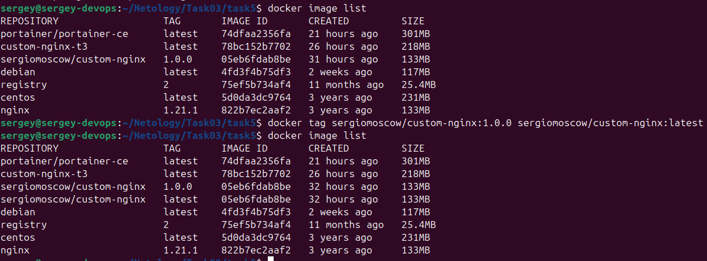

## Задача 1
Скачать образ nginx 1.21.1

`docker pull nginx:1.21.1`

Запушить образ Dockerfile:

`docker login`

`docker build -t sergiomoscow/custom-nginx:1.0.0 .`

`docker push sergiomoscow/custom-nginx:1.0.0`

Скачать образ:

`docker pull sergiomoscow/custom-nginx:1.0.0`

## Задача 2
Запуск контейнера:

`docker run --name sushkov-sv-custom-nginx-t2 -d -p 8080:80 sergiomoscow/custom-nginx:1.0.0`


Проверка доступности страницы:


Переименование контейнера:

`docker rename sushkov-sv-custom-nginx-t2 custom-nginx-t2`


## Задача 3

Подключение к стандартному потоку ввода/вывода контейнера:

`docker attach custom-nginx-t2`

Нажатие Ctrl+C


Контейнер остановился, т.к. комбинация клавиш Ctrl+C генерирует сигнал (SIGINT) на остановку процесса. Т.к. терминал подключен к вводу-выводу контейнера, то этот сигнал передаётся в основной процесс контейнера, что и завершает его работу.

Для выхода из attach без остановки контейнера можно использовать Ctrl+P или Ctrl+Q

Перезапуск:

`docker start custom-nginx-t2`

Установка mc с редактором mcedit:

`apt-get update`

`apt-get install mc`

Меняем порт на 81:


Перезагружаем nginx и проверяем ответ на портах 80 и 81 внутри контейнера:


Проверяем снаружи:


Исправляем соединение:
(шпаргалка https://www.baeldung.com/ops/assign-port-docker-container)
- Находим id

`docker inspect --format="{{.Id}}" custom-nginx-t2` - Получаем папку контейнера


- `systemctl stop docker` - останавливаем службу docker для изменения файлов конфигурации контейнера

- cd `/var/lib/docker/containers/<container_id>/`

- в файле `hostconfig.json` ключ `"PortBindings"` меняем `80/tcp` на `81/tcp`.


- в файле `config.v2.json` ключ `"ExposedPorts"` меняем также `80/tcp` на `81/tcp`.


- `systemctl start docker` - запускаем службу docker

- `docker start custom-nginx-t2` - запускаем контейнер

- проверяем в браузере или через curl.

Удалить запущенный контейнер:

`docker rm -f custom-nginx-t2`


## Задача 4
- Скачиваем образы centos и debian:

`docker image pull centos:latest`

`docker image pull debian:latest`

- Запускаем образы:

`docker run -v $(pwd):/data --name centos -d centos:latest tail -f > /dev/null`

`docker run -v $(pwd):/data --name debian -d debian:latest tail -f > /dev/null`


- Входим внутрь контейнера centos, создаём файл и выходим:

`docker exec -it centos /bin/bash`

`echo text file from centos > /data/centos.txt`

`exit`

- Создаём файл с хоста:

`echo text file from host > /data/host.txt`


- Входим внутрь контейнера debian и смотрим содержимое:

`docker exec -it debian /bin/bash`

`ls /data`


## Задача 5


Обрабатывается compose.yml, т.к. это имя предпочтительно. docker-compose.yml как файл конфигурации сохранился для обратной совместимости.

Добавляем строки в compose.yml:

```
include:
  - docker-compose.yml
```

Теперь обрабатываются оба yml файла:


Подгружаю мой образ custom-nginx из docker hub:

`docker pull sergiomosow/custom-nginx:1.0.0`


`docker tag sergiomoscow/custom-nginx:1.0.0 sergiomoscow/custom-nginx:latest`

После этой команды произошло изменение также в списке локальных образов:



А именно, sergiomoscow/custom-nginx уже появляется 2 раза с разными тегами.

Помечаем образ как localhost:5000/custom-nginx:latest:
`docker tag sergiomoscow/custom-nginx:latest localhost:5000/custom-nginx:latest`

И помещаем его в локальное registry:

`docker push localhost:5000/custom-nginx:latest`


Config из portainer inspect:


Удаляем compose.yml и запускаем

`docker compose up -d`


Выполняем предложенное действие:

`docker compose up -d --remove-orphans`


Гасим compose проект:

`docker compose down -v`


Убеждаемся, что контейнеров из compose и docker-compose нет:

`docker ps -a`

